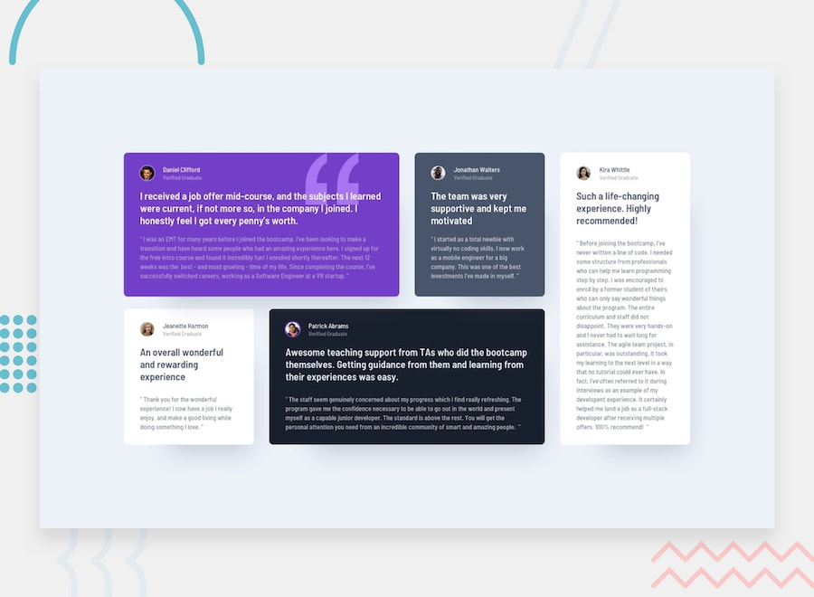

# Frontend Mentor - Testimonials Grid Section Solution

This is a solution to the [Testimonials grid section challenge on Frontend Mentor](https://www.frontendmentor.io/challenges/testimonials-grid-section-Nnw6J7Un7). Frontend Mentor challenges help you improve your coding skills by building realistic projects.


## Overview

### The challenge

Users should be able to:

- View the optimal layout for the site depending on their device's screen size





## My process

### Built with

- Semantic HTML5 markup
- CSS Grid
- CSS custom properties
- Mobile-first workflow
- Google Fonts (Barlow Semi Condensed)
- Responsive design principles

### What I learned

This project was an excellent opportunity to practice CSS Grid layout and responsive design. Here are some key learnings:

**CSS Grid Layout**: I implemented a complex grid layout that changes from a 4-column desktop layout to a single-column mobile layout.

```css
.testimonials-grid {
  display: grid;
  grid-template-columns: repeat(4, 1fr);
  grid-template-rows: repeat(2, auto);
  gap: 30px 24px;
}

.daniel {
  grid-column: 1 / 3;
  grid-row: 1;
}

.kira {
  grid-column: 4;
  grid-row: 1 / 3;
}
```

**Responsive Design**: Used mobile-first approach with media queries to ensure the layout works perfectly on all devices.

```css
@media (max-width: 768px) {
  .testimonials-grid {
    grid-template-columns: 1fr;
    grid-template-rows: repeat(5, auto);
  }
}
```

**Semantic HTML**: Structured the content using semantic elements for better accessibility and SEO.

```html
<main class="testimonials-grid">
  <article class="testimonial daniel">
    <div class="testimonial-header">
      
      <div class="profile-info">
        <h2 class="name">Daniel Clifford</h2>
        <p class="status">Verified Graduate</p>
      </div>
    </div>
    <blockquote class="testimonial-content">
      <!-- Content -->
    </blockquote>
  </article>
</main>
```

### Continued development

Areas I want to continue focusing on in future projects:

- Advanced CSS Grid techniques and subgrid
- CSS animations and transitions for enhanced user experience
- Accessibility improvements (ARIA labels, keyboard navigation)
- Performance optimization techniques
- CSS custom properties for better maintainability

### Useful resources

- [CSS Grid Guide](https://css-tricks.com/snippets/css/complete-guide-grid/) - Comprehensive guide to CSS Grid
- [MDN CSS Grid](https://developer.mozilla.org/en-US/docs/Web/CSS/CSS_Grid_Layout) - Official documentation
- [Google Fonts](https://fonts.google.com/) - For the Barlow Semi Condensed font
- [Can I Use](https://caniuse.com/) - For checking browser compatibility

## Author

- Frontend Mentor - [@Ayokanmi-Adejola](https://www.frontendmentor.io/profile/Ayokanmi-Adejola)
